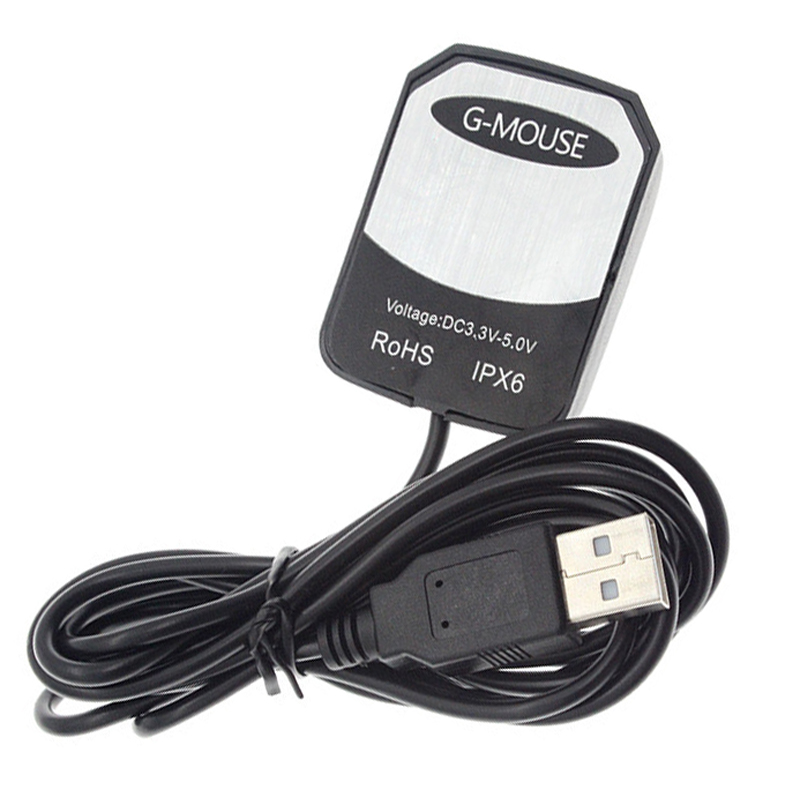

# PARTE 1: Wardriving con "Raspberry Pi 3 B+" + "Kismet" + "GPS VK-162"

Implementación de una plataforma portátil de **Wardriving** utilizando **Raspberry Pi 3 B+**, una antena **Wi-Fi en modo monitor** y un receptor **GPS USB VK-162**, con captura automática mediante **Kismet**.

---

# Arquitectura del Proyecto

```text
Raspberry Pi 3 B+
      │
      ├── USB WiFi RTL8812AU (Monitor)
      │          │
      │          └── Captura → Kismet
      │
      └── USB GPS VK-162
                 │
                 └── GPS → gpsd → Kismet
```

---

# Material Utilizado

| Componente   | Modelo                            |
| ------------ | --------------------------------- |
| Raspberry Pi | Raspberry Pi 3 B+                 |
| Antena WiFi  | TP-Link Archer T4UHP (US) Ver 1.0 |
| Chipset WiFi | RTL8812AU                         |
| GPS          | VK-162                            |
| Chip GPS     | u-blox 7                          |
| Protocolo    | NMEA 0183                         |

<p align="center">
<br>
<br>
<br>



</p>

---

# Software Utilizado

* Raspberry Pi OS Lite (64 bits)
* Debian Trixie
* Kismet
* gpsd
* aircrack-ng

---

# Preparación del Sistema Operativo

Instalar Raspberry Pi OS Lite para optimizar memoria.

<p align="center">

</p>

Ingresar por SSH (recomendado mediante Ethernet).

<p align="center">

</p>

Verificar arquitectura:

```bash
uname -m
uname -r
```

Salida esperada:

```text
aarch64
6.12.75+rpt-rpi-v8
```

---

# Instalación del Driver RTL8812AU

Instalar dependencias:

```bash
sudo apt update

sudo apt install -y \
build-essential \
dkms \
git \
libelf-dev \
bc \
aircrack-ng

sudo apt install -y linux-headers-rpi-v8
```

Clonar e instalar:

```bash
cd /usr/src

sudo git clone -b v5.6.4.2 \
https://github.com/aircrack-ng/rtl8812au.git

cd rtl8812au

sudo make
sudo make install

sudo depmod -a

sudo reboot
```

---

# Configuración del Modo Monitor

Detectar interfaz:

```bash
sudo airmon-ng
```

<p align="center">

</p>

Ejemplo: `wlan1`

Activar modo monitor:

```bash
sudo systemctl stop wpa_supplicant 2>/dev/null
sudo killall wpa_supplicant 2>/dev/null

sudo rfkill unblock all

sudo ip link set wlan1 down
sudo iw dev wlan1 set type monitor
sudo ip link set wlan1 up

iw dev
```

Validar captura:

```bash
sudo airodump-ng wlan1
```

> CTRL + C para detener.

Volver a modo normal:

```bash
sudo ip link set wlan1 down
sudo iw dev wlan1 set type managed
sudo ip link set wlan1 up

sudo systemctl start wpa_supplicant
```

---

# Configuración del GPS VK-162

Detectar dispositivo:

```bash
for dev in /dev/ttyACM*; do
echo "===== $dev ====="
udevadm info -q property -n $dev \
| grep -E "ID_VENDOR=|ID_MODEL="
done
```

Ejemplo:

```text
/dev/ttyACM0 → Arduino
/dev/ttyACM1 → VK-162
```

Instalar GPSD:

```bash
sudo apt update

sudo apt install -y gpsd gpsd-clients
```

Probar:

```bash
sudo systemctl stop gpsd.socket

sudo gpsd /dev/ttyACM1 \
-F /var/run/gpsd.sock

cgps -s
```

Editar:

```bash
sudo nano /etc/default/gpsd
```

```ini
START_DAEMON="true"
DEVICES="/dev/ttyACM1"
GPSD_OPTIONS="-n"
USBAUTO="false"
```

Levantar GPS:

```bash
sudo killall gpsd 2>/dev/null

sudo systemctl stop gpsd
sudo systemctl stop gpsd.socket

sudo rm -f /var/run/gpsd.sock

sudo gpsd \
/dev/ttyACM1 \
-F /var/run/gpsd.sock

sleep 2

cgps -s
```

---

# Instalación de Kismet

```bash
sudo mkdir -p /etc/apt/keyrings

wget -O /tmp/kismet.key \
https://www.kismetwireless.net/repos/kismet-release.gpg.key

sudo gpg --dearmor \
-o /etc/apt/keyrings/kismet.gpg \
/tmp/kismet.key

echo \
"deb [signed-by=/etc/apt/keyrings/kismet.gpg] https://www.kismetwireless.net/repos/apt/release/trixie trixie main" \
| sudo tee \
/etc/apt/sources.list.d/kismet.list

sudo apt update

sudo apt install -y kismet
```

Verificar:

```bash
kismet -v
```

Editar:

```bash
sudo nano /etc/kismet/kismet.conf
```

Modificar:

```ini
source=wlan1:type=linuxwifi
gps=gpsd:host=localhost,port=2947
```

Editar:

```bash
sudo nano /etc/kismet/kismet_logging.conf
```

Modificar:

```ini
log_prefix=/home/americo/db_sensores/
```

Esto define dónde se almacenarán los archivos `.kismet`.

---

# 🤖 Scripts Automatizados

## Opción 1 — Primer Plano

Ejecutar:

```bash
kismet_up.sh
```

Archivo:

```text
kismet_prog/kismet_up.sh
```

---

## Opción 2 — Segundo Plano (Recomendado)

Instalar Screen:

```bash
sudo apt update
sudo apt install -y screen
```

Verificar:

```bash
screen --version
```

Ejecutar:

```bash
./2_start_wardrive.sh
```

Flujo:

```text
screen -S wardrive
↓
ejecuta kismet_up.sh
↓
inicia gpsd
↓
pone wlan1 monitor
↓
inicia Kismet
↓
devuelve SSH
```

guardando los arcfhivos *.kismet en db_sensores/  de manera automatica ordenando la generacion de la base de datos kismet

---


## PARTE 2 — Sistema de Telemetria y Adquisicion de Datos (Arduino + Raspberry Pi)


# PARTE 2: Captura de sensores "Arduino" + "Arduino Training Shield V2" + "Raspberry pi b3+" Implementación de una plataforma portátil que realiza la captura de varios sensore(presentes en el arduino train shield v2) utilizando **Arduino Uno** como concentrador de datos y al cual estan conectados los sensores y luego este arduino, envia los datos al raspberry pi quien conectra todos los datos recibidos en una sola base de datos sqlite. --- # Arquitectura del sistema de recoleccion de datos de sensores
text
Raspberry Pi 3 B+
      │
      ├── Arduino uno conectado con el Arduino Training Shield V2
      │          │
      │          └── Sensor de temperatura LM35, Sensor de luz / LDR A1, Sensor digital de humedad y temperatura DHT11 D4, Sensor IR de 38 kHz D6
      │
--- # Material Utilizado | Componente | Modelo | | ------------ | --------------------------------- | | Raspberry Pi | Raspberry Pi 3 B+ | | Arduino uno | Arduino uno | | sensores varios | Arduino Training Shield V2 | | Comunicacion | seria rs232 | <p align="center"> <br> <br> <br> </p> --- # Software Utilizado * Raspberry Pi OS Lite (64 bits) * Debian Trixie * sqlite * python --- # preparacion de SO - instalando arduino Actualizar el sistema sudo apt update sudo apt full-upgrade -y 2. Instalar dependencias sudo apt install -y curl git unzip 3. Instalar Arduino CLI Descarga e instala la versión oficial: curl -fsSL https://raw.githubusercontent.com/arduino/arduino-cli/master/install.sh | sh Mover el ejecutable: sudo mv bin/arduino-cli /usr/local/bin/ Verificar: arduino-cli version arduino-cli config init Deberías obtener algo similar a: Config file written to: /home/americo/.arduino15/arduino-cli.yaml Luego verifica: ls -l ~/.arduino15/ cat ~/.arduino15/arduino-cli.yaml Después actualiza el índice de placas: arduino-cli core update-index instalar placas de arduino arduino-cli core install arduino:avr Ver qué placas tienes instaladas arduino-cli core list Conectar Arduino y verificar puerto: arduino-cli board list sudo apt update sudo apt install python3-pip -y pip3 --version sudo apt update sudo apt install python3-serial -y VERIFICAR python3 -c "import serial; print(serial.__version__)" Verificar que Arduino aparece Ejecuta: ls /dev/tty* --- # Programar arduino desde el raspberry estructura de archivos /home/americo/arduino/ ├── sensores/ │ └── sensores.ino │ └── cargar_arduino.sh cuando se ejecute el script cargar arduino.sh de manera automatica verificara las carpetas que estan dentro de /home/americo/arduino/ y cada una de estas carpetas tendra dentro el archivo ino que es llamado igual que el nombre de la carpeta
