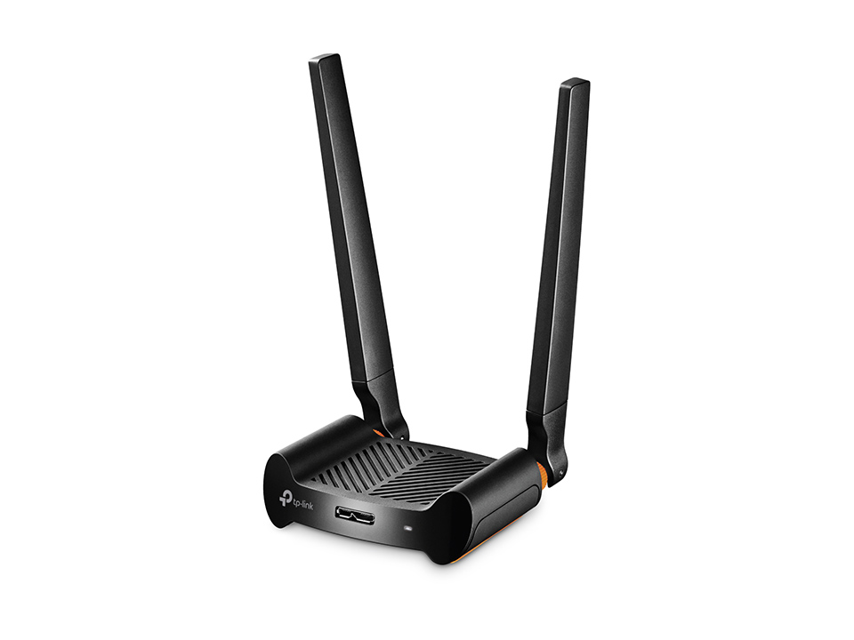

# wardriving implementacion con raspberry pi b3

## Material utilizado
- raspberry pi 3 b+
- USB - WIFI con modo monitor (TP-Link Archer T4UHP(US) VER:1.0. con chipset RTL8812AU)
- USB - GPS VK-162 (Chip GPS u-blox 7 con salida de datos protocolo NMEA 0183)

</br>
</br>
</br>
</br>

## Software
- Sistema Operativo Raspberry Pi OS Lite (64bits) a port of Debian Trixie with no desktop environment.
- Kismet 
### Preparar S.O. e instalar herramientas
**Instalar Raspbian CLI** para optimizar el consumo de memoria.</br>
</br>
Ingresamos por ssh a la consola del raspberry (recomendacion conectar con cable ethernet)</br>
</br>
Se verifica arquitectura y kernel:  </br>
`uname -m `</br>
aarch64</br>   
`uname -r `</br>
6.12.75+rpt-rpi-v8</br>
**instalar dependencias y headers para el kernel especifico de la raspberry pi b3**</br>
`sudo apt update`</br>
`sudo apt install -y build-essential dkms git libelf-dev bc aircrack-ng`</br>
`sudo apt install -y linux-headers-rpi-v8`</br>
**Clonar el driver para chipset rtl8812au especifico para antena wifi**</br>
`cd /usr/src`</br>
`sudo git clone -b v5.6.4.2 https://github.com/aircrack-ng/rtl8812au.git`</br>
`cd rtl8812au`</br>
`sudo make`</br>
`sudo make install`</br>
`sudo depmod -a`</br>
`sudo reboot`</br>
**Colocar antena en modo monitor** </br>
verificar en que wlan* esta la antena wifi con modo monitor </br>
`sudo airmon-ng`</br>
</br>
en mi caso esta en wlan01</br>
`sudo systemctl stop wpa_supplicant 2>/dev/null`</br>
`sudo killall wpa_supplicant 2>/dev/null`</br>
`sudo rfkill unblock all`</br>
`sudo ip link set wlan1 down`</br>
`sudo iw dev wlan1 set type monitor`</br>
`sudo ip link set wlan1 up`</br>
`iw dev`</br>
Verificar con un aridodump si todo funciona bien</br>
`sudo airodump-ng wlan1`</br>
*nota: CTRL + C  para detener una vez verioficado que esta funcionando*</br>
**Colocar antena en modo managed (normal mode)** </br>
`sudo ip link set wlan1 down`</br>
`sudo iw dev wlan1 set type managed`</br>
`sudo ip link set wlan1 up`</br>
`sudo systemctl start wpa_supplicant`</br>

**Instalar y utilizar el VK162 USB** </br>
Primero se debe de identificar en que USB esta conectado el VK162 y talvez otro dispositivo
```
for dev in /dev/ttyACM*; do
    echo "===== $dev ====="
    udevadm info -q property -n $dev | grep -E "ID_VENDOR=|ID_MODEL="
done
```
nota: en mi caso esta en el:</br>
===== /dev/ttyACM0 =====</br>
ID_MODEL=0043</br>
ID_VENDOR=Arduino__www.arduino.cc_</br>
===== /dev/ttyACM1 =====</br>
ID_MODEL=u-blox_7_-_GPS_GNSS_Receiver </br>
ID_VENDOR=u-blox_AG_-_www.u-blox.com </br>

Instalar el driver del VK-162 </br>
`sudo apt update`</br>
`sudo apt install -y gpsd gpsd-clients`</br>
`sudo systemctl stop gpsd.socket`</br>
`sudo gpsd /dev/ttyACM1 -F /var/run/gpsd.sock`</br>
`cgps -s`</br>
*nota: CTRL + C  para detener una vez verioficado que esta funcionando*</br>

Modificar el archivo gpsd: `sudo nano /etc/default/gpsd`</br>
```
START_DAEMON="true"
DEVICES="/dev/ttyACM1"
GPSD_OPTIONS="-n"
USBAUTO="false"
```
**Colocar levantar VK-162** </br>
`sudo killall gpsd 2>/dev/null`</br>
`sudo systemctl stop gpsd 2>/dev/null`</br>
`sudo systemctl stop gpsd.socket 2>/dev/null`</br>
`sudo rm -f /var/run/gpsd.sock`</br>
`sudo gpsd /dev/ttyACM1 -F /var/run/gpsd.sock`</br>
`sleep 2`</br>
`cgps -s`</br>


**Instalar KISMET** </br>
```
sudo mkdir -p /etc/apt/keyrings
wget -O /tmp/kismet.key https://www.kismetwireless.net/repos/kismet-release.gpg.key
sudo gpg --dearmor -o /etc/apt/keyrings/kismet.gpg /tmp/kismet.key
echo "deb [signed-by=/etc/apt/keyrings/kismet.gpg] https://www.kismetwireless.net/repos/apt/release/trixie trixie main" | sudo tee /etc/apt/sources.list.d/kismet.list
sudo apt update
sudo apt install -y kismet
```
verificando instalacion </br>
`kismet -v`</br>
ingresar a la siguiente direccion `sudo nano /etc/kismet/kismet.conf`  </br>
y colocar las siguientes lineas (descomentar y modificar): </br>
```
source=wlan1:type=linuxwifi
gps=gpsd:host=localhost,port=2947
```

## SCRIPTS AUTOMATIZADOS
1. Levantar Kismet: de manera directa en primer plano kismet_up.sh
   [codigo completo aqui](kismet_prog/kismet_up.sh)
2. Levantar Kismet: en segundo plano (recomendado) utilizando screen
- Se debe de instalar antes screen  </br>
`sudo apt update`   </br>
`sudo apt install -y screen`  </br>
verificar si instalo correctamente  </br>
`screen --version`  </br>
- Luego lanzar [este codigo](kismet_prog/start_wardrive.sh) automatizado que realiza las siguientes acciones:  </br> screen -S wardrive
↓
ejecuta kismet_up.sh
↓
arranca gpsd
↓
pone wlan1 monitor
↓
levanta Kismet
↓
te devuelve el prompt SSH
- y estara obteniendo automaticamente la captura kismet, pero cuando quiero cerrar la sesion solamente ejecutar [este codigo](kismet_prog/stop_wardrive.sh)
